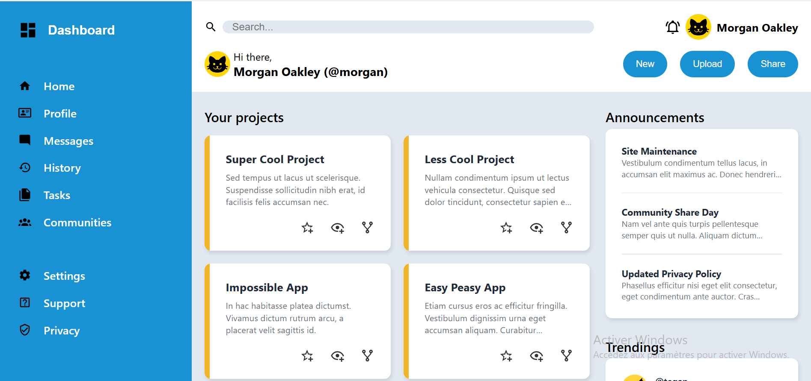
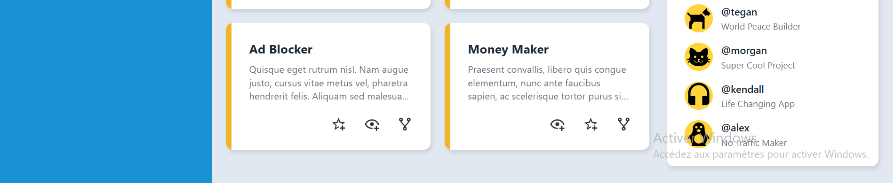

# Dashboard-project

## 📖 About the Project
Dashboard layout built with **HTML** and **CSS Grid** as part of [The Odin Project](https://www.theodinprojectcom/) curriculum.

## Features:
- clean and modern design
- Built with CSS grid layout
- Minimal HTML structure

### Project Structure

```plaintext
├── images/ , for the icons used
├── screenshots/ , screenshots of the page
├── index.html
├── README.md
└── styles.css
```

## 📸 Preview





## 💡 Future Improvements
* Make the design responsive 
* Add interactivity with javascript 